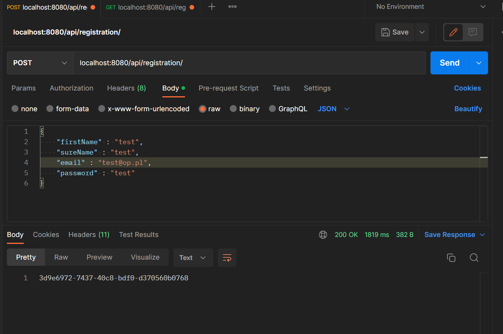
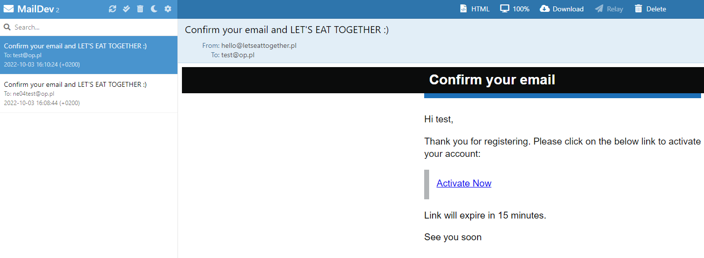
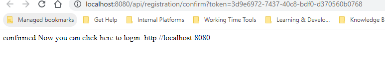

## Installation

1. Download Docker Desktop App -> https://docs.docker.com/desktop/install/windows-install/
(You''ll have a recommendation to use WSL2, but after that you'll need to install Linux kernel, so I didn't click that option)
2. I used maildev to testing emails, if you want to read more about it: https://github.com/maildev/maildev
3. To run maildev, open cmd and use the command : 
``` docker run -p 1080:1080 -p 1025:1025 maildev/maildev``` 
4. After that make sure that MariaDB is working 

## How to run the app?
1. Fill in fields called login and password in application.yml, you can change the database's name if you want
2. Using (in my case) postman I create a request like that: 
3. Now you must check our mailbox to confirm the mail, open the browser and http://localhost:1080/

4.Click hyperlink called "Active Now" and you should see a website with confirmation

5.After that you can visit main page (localhost:8080) and you can log in using your email and password (you should see website with information about 404 error - I didn't implement any functionality)

Have fun <3 